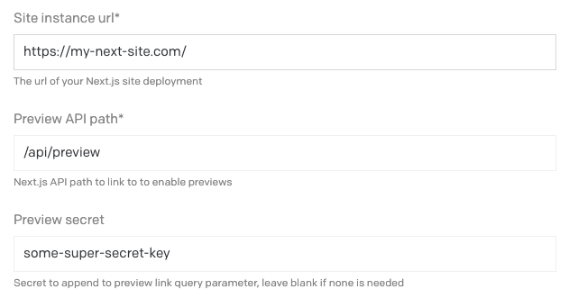
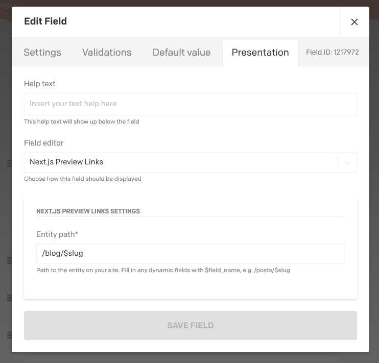
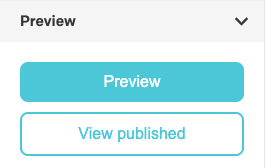

# Next.js Preview Links DatoCMS Plugin

Plugin that adds quick links to preview & view your DatoCMS on a Next.js site.
Assumes you have a preview implementation based off of the [official Next.js Preview Mode guide](https://nextjs.org/docs/advanced-features/preview-mode).

## Configuration

After installing the plugin, you'll need to configure the plugin settings like so:



Then on each model you'd like to be able to preview, you'll need to add a JSON field, and under the "Presentation"
tab, you'll want to select "Next.js Preview Links" as the "Field editor", and fill out the entity path for the
given entity on your site. You can sub in any field on the entity using the $field_name, e.g. /blog/$slug or
/product/$id.



## Preview Links 

Once you've configured the plugin and added the field to a model, you will be able to see it as a sidebar widget. 



A blog post with a slug of `my-first-post` using the configuration from the example above would link to:

* `https://my-next-site.com/api/preview?secret=some-super-secret-key&slug=/blog/my-first-post` for the "Preview" link
* `https://my-next-site.com/blog/my-first-post` for the "View published" link

The query params on the API preview path are not configurable, and are based on Next.js'
[Preview Mode guide](https://nextjs.org/docs/advanced-features/preview-mode).

## Disable Preview Links (optional)

By default, the Next.js preview mode persists through a browser session. However, this could have unintended consequences for the editor experience, such as subsequent "View published page" button clicks showing the preview page instead of the published page (because it's still the same browser session).

To work around this, you can create another [Next.js API route that clears the preview mode cookies and then redirects to the page slug](https://nextjs.org/docs/advanced-features/preview-mode#clear-the-preview-mode-cookies). An example `disable-preview.js` API route might look like this:

```
export default function handler(req, res) {
  // Clears the preview mode cookies.
  // This function accepts no arguments.
  res.clearPreviewData()

  if (req.query.slug) {
    // Redirect to the path from the fetched post
    res.redirect(req.query.slug)
  } else {
    res.end('Preview mode disabled');
  }
}
```

Once this API route is set up, you can specify the "Disable preview API path" in the plugin settings with its path, such as `/api/disable-preview`. This will cause the "View published page" button to go to that route first, with the slug attached as a parameter, and the API route should redirect to the intended page once preview mode has been disabled.

This way, the "Preview" button should always show the preview page, and the "View published page" should always show the published page (by forcing the preview cookies to be cleared every time).

## Development

If you want to develop on this extension, the quickest way is to run `yarn addToProject`. That will walk you through
setting it up. If you have trouble going through that setup, you can manually install it by going to Settings > Plugins,
clicking the add button, and clicking "create a private one" in the lower right. Give it:

* a name of your choosing
* an entry point URL of `http://localhost:5000`
* `Sidebar widget` as type of plugin
* `JSON` as field types
* Copy the JSON from `package.json`'s `parameters` object into the parameter defintions

After that, you can just run `yarn start`, and it should be loading in the sidebar after you configure it with a model.

This project was largely based on the [Gatsby plugin](https://github.com/gatsby-inc/datocms-plugin-gatsby-cloud),
and the [DatoCMS Todo List example plugin](https://github.com/datocms/plugins/tree/master/todo-list).
